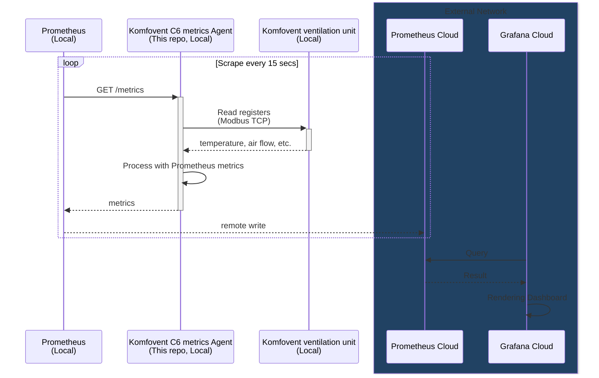

# Komfovent C6 metrics

A Node.js server that exposes status and metrics of the Komfovent C6M ventilation unit.

## Overview



## Getting Started

```sh
cd prometheus

# Open the docker-compose.yaml file and modify MODBUS_TCP_IP and MODBUS_TCP_PORT appropriately."

# Set up `remote_write` Prometheus config to send metric data to a remote system.

# Run
docker compose up -d
```

## For Developers

### Getting Started

```sh
export MODBUS_TCP_IP=<Your device IP>
export MODBUS_TCP_PORT=<Your device Port>
export SERVER_PORT=<Server Port>

npm run build
node ./dist/index.js
```

### APIs

- `GET /metrics`: An API that returns various ventilation unit metrics as Prometheus format.
- `GET /info`: An API that returns various ventilation unit metrics as JSON format.

### Build

```sh
docker buildx create --use
docker buildx build --platform=linux/arm/v7,linux/arm64,linux/amd64 -t wokim/komfovent-c6-metrics:latest --target release --push .
docker buildx build --platform=linux/arm/v7,linux/arm64,linux/amd64 -t wokim/komfovent-c6-metrics:0.0.1 --target release --push .
```
